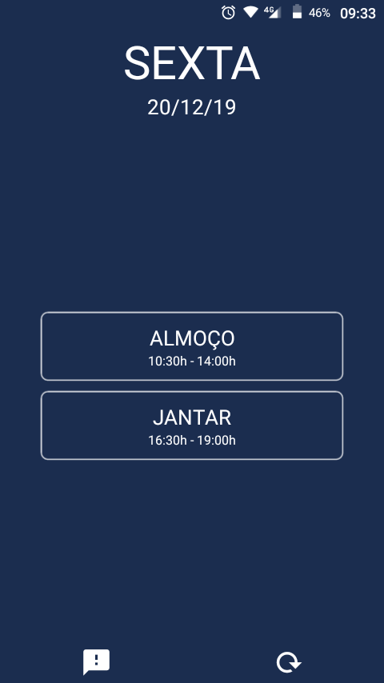
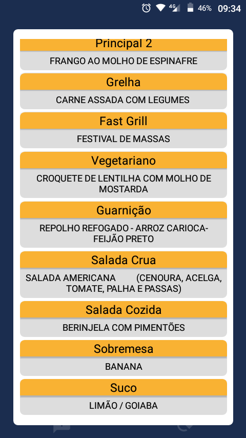

# RUral

> Cardápio para o Restaurante Universitário da UFRPE.

## O Projeto

- O aplicativo não tem fins lucrativos

- Qualquer estudante da UFRPE pode contribuir com o app das seguintes formas:

  - **Design:** contribuindo com ideias de UX e design de aplicativos em geral, acesse o [Figma](https://www.figma.com/file/w2u7Z3MAA8tDXvoJHWaoe8/RUral?node-id=0%3A1)
    .

  - **Programação:** contribuindo com novas funcionalidades ou correções no código.

  - **Sugestões:** criando issues para criação de novas funcionalidades.
